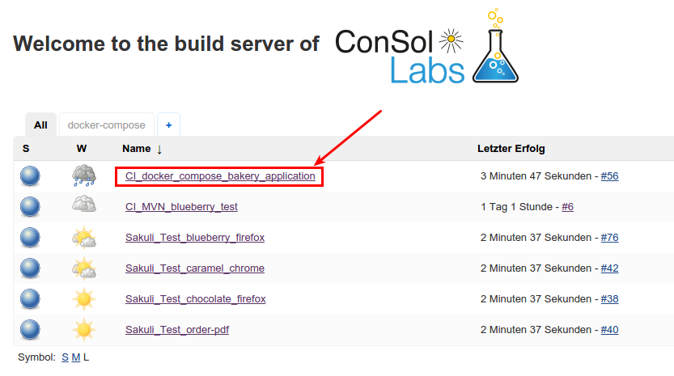

Demo Web Application "Backery"
==============================

---------

The cookie bakery demo sample application uses a multi module Maven project with each module being deployed in a separate
Docker container. The modules are:

* web
* worker
* report


Using this example with Docker
------------------------------

Lets build the
sample Docker application images by calling:

```
mvn -f bakery-app/pom.xml clean package
```

Now you will be able to see some more docker images on your host.

```
docker images
```

Now you are able to lunch the application and running the Sakuli End-2-End-Tests. Therefor you have two ways to do this, using **maven** or **docker-compose**.
This may take a while when executed for the first time as Docker images will be loaded from DockerHub repository for Java,
Tomcat, ActiveMQ and so on. After that you will then see some Docker containers started on your host

```
docker ps
```

You will see Docker containers running on your host:

* bakery-web-server
* report-server
* activemq-server
* worker-chocolate
* worker-blueberry
* worker-caramel


### Using docker-compose
To lunch the hole application from scratch just execute the following script:

```
bakery-app/app-deployment-docker-compose/deploy_app.sh
```

After the bakery application is fully running, you can execute the Sakuli E2E tests. The docker-compose config you will find under the folder `sakuli-tests/docker-compose.yml`. To start **all** tests in one glance just execute:

```
sakuli-tests/execute_all.sh
```
To start **one** specific tests, you can define the environment variable `TESTSUITE` and execute the script `execute_compose_test.sh`:

```
TESTSUITE='order-pdf' sakuli-tests/execute_compose_test.sh
```

### Using maven

To lunch the **application only**, just use the maven module `app-deployment-maven`:

```
mvn -f bakery-app/app-deployment-maven/pom.xml clean verify
```

To execute the **application and the Sakuli UI tests** in a glance, use the maven module `sakuli-tests-maven`:

```
mvn -f bakery-app/sakuli-tests-maven/pom.xml clean verify
```

### Watch into the Sakuli-Container via VNC

Now you are able to watch the Sakuli tests running over VNC (Ports `5911 - 5914`) or over the web vnc client, open [vnc_overview_local.html](vnc_overview_local.html)


Starting the example via Jenkins CI:
------------------------------------
This example also povides an Jenkins configured CI-Job to show how easily it is to include Sakuli tests in your own CI-Build. For this go the folder `jenkins`,
start Jenkins via **docker-compose** and go to the site http://localhost:8080/.

```
jenkins/deploy_jenkins.sh
```

After the Jenkins docker-container is running, you will be able to execute the Job [CI_docker_compose_bakery_application](http://localhost:8080/job/CI_docker_compose_bakery_application/)



For better visualization, go to the view `docker-compose` and look at build pipeline. There you will see, that the job
[CI_docker_compose_bakery_application](http://localhost:8080/job/CI_docker_compose_bakery_application/) will start four sub-jobs starting with the name `Sakuli_Test*`.
As long as the `Sakuli_Test*` are running, you can take again a look into the container via the VNC overview page [vnc_overview_local.html](vnc_overview_local.html).


Starting the example as continuous E2E monitoring check (OMD nagios)
--------------------------------------------------------------------
**1) start OMD monitoring server**

```
omd-nagios/deploy_omd.sh
```
Now open your browser and enter the URL https://localhost:8043/demo/thruk/#cgi-bin/status.cgi?host=all and you will find an overview over the 4 monitoring checks `blueberry`, `caramel`, `chocolate` and `order-pdf`. As soon the OMD server will get new results they will be displayed there.


**2) start monitoring checks**

```
sakuli-tests/execute_all_4_monitoring.sh
```
The script will execute all four implemented Sakuli tests as monitoring checks and send the result to already running OMD server. The script will repeat the test execution after a break of 15 seconds as long as the script didn't get stopped. To stop the script execution simply press `CTRL + C`.

- - -

### Docker machine user

This sample is using Docker as infrastructure for starting up the services in separate containers. The sample application
makes use of Docker environment variables and hsit name settings that need to be set befoer using the application. Non-Linux
users might want to add dockerhost to your /etc/hosts configuration in order to simply access the
services running in Docker containers without any port forwarding:

```
echo $(docker-machine ip your-docker-machine-name) dockerhost | sudo tee -a /etc/hosts
```

In the parent Maven POM you will find properties pointing to the dockerhost.

```
<docker.host.name>dockerhost</docker.host.name>
```

You might want to adjust these properties by adding following parameters to the Maven commands shown in this readme:

```
-Ddocker.host.name=dockerHostName
```

Now you can build the Docker containers. Be sure that Docker is setup and running on your local machine.
